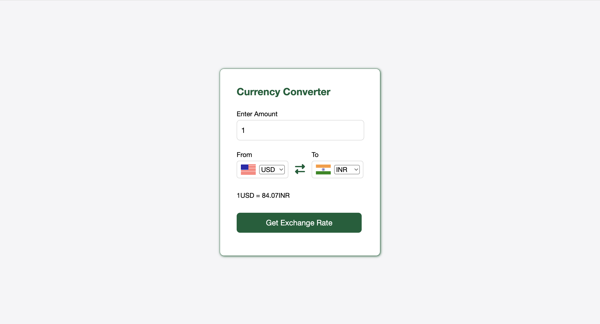

# Currency Converter Web App

A simple and user-friendly Currency Converter web application built using HTML5, CSS, and JavaScript. This app allows users to convert between various currencies with real-time exchange rates.

## Live Demo

You can view the live demo of this web App [here](https://yogeshpol96.github.io/Currency-Converter-webApp/).

## Features 

- Convert between multiple currencies
- User-friendly interface with real-time exchange rates
- Dynamic country flags based on selected currencies
- Responsive design suitable for both mobile and desktop devices

## Technologies Used

- HTML5
- CSS3
- JavaScript

## API Used
- https://cdn.jsdelivr.net/gh/fawazahmed0/currency-api@1/latest/currencies/eur/jpy.json

## Getting Started

### Prerequisites

Internet connection and make sure you have a modern web browser installed. No additional software is needed to run the app.

## Usage
1. Enter the amount you wish to convert in the input field.
2. Select the currency you want to convert **From** and **To** using the dropdown menu.
3. Click the **Get Exchange Rate** button to see the converted amount.
4. The exchange rates are updated in real-time.

## Acknowledgments

Thanks to Fawaz Ahmed for providing the currency API for exchange rates. 
Thanks to (https://flagsapi.com/) for providing high-quality country flag images used in the app.
Thanks to Font Awesome for the icon set.

## Screenshots

